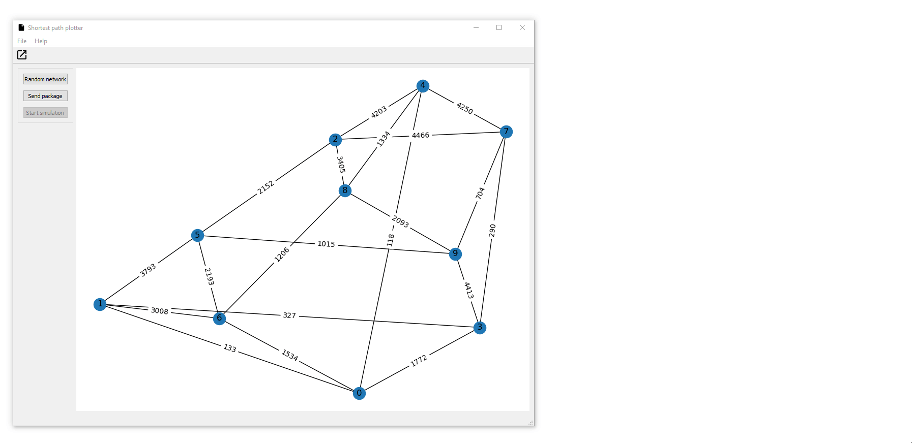

# Shortest path plotter



This is a PyQt5 app whose purpose is to plot the shortest path between two nodes of a undirected
weighted graph, it uses NetworkX and Matplotlib. The purpose of the app is to simulate the shortest
path calculation of a routing algorithm, because of this it uses the Bellman-Ford algorithm to calculate 
the shortest path.

Also, it uses Simpy to simulate the packet traversal from one node to another.

### Installation
* Install [poetry](https://python-poetry.org/docs/)
* Run ```poetry install```
* Run ```main.py```

### Features
* Creates random complete graphs with 10 nodes and weights from 0 to 5000
* Loads graphs from a Graphviz DOT file
* Loads graphs as a CSV file
* Paints the path traveled by the "package"

## Usage

## Graph creation

### Random graph

Select "Random graph" for a random complete graph with weighted edges from 0 to 5000.

### Graphviz DOT file

Select "Open file" (or hit ```CTRL + O```) to open a Graphviz Dot file.
The file must have the ```.dot``` and the following format:

```
graph {
    1 -- 2[label=2];
    3 -- 4[label=3];
    5 -- 4[label=5];
}
``` 

Which means an adjacency matrix for the graph, for more information refer to the DOT language 
[specification](https://graphviz.gitlab.io/_pages/doc/info/lang.html).

**Important**: edges must have the ```label``` property set to a number as this will be parsed as the edge weight. 
Non integer node names will be converted to numbers.

Refer to the ```test.dot``` file for an example.

### CSV File
Select "Open file" (or hit ```CTRL + O```) to open a CSV File.
The file must have the ```.csv``` and the following format:

```
1,2,3
4,5,7
```

Where the first element is the start node, the next element the end node and the next element the weight
of the edge that connects them. All nodes must be integers. Refer to the ```test.csv``` file for an example.

## Data set

After creating the graph, click "Send package" to select the start and end node, as well as the data.
A window will pop up, select the start and end node and enter the "package"; it mus be comprised of 0 or 1
and can be no longer that 8 (meaning a binary package of 8 bits).

## Simulation start

Click "Start simulation", log window will register the nodes involved in the transmission.

### Possible upgrades
* Add more shortest path algorithms (Dijstra, A*, etc) and allow the user to select them
* Animate how the package travels through the nodes (it currently is in real time, but the render time 
is greater than the simulation time)
* Allow two or more simulations to run at the same time and take into account the "busy" edges
* Allow the user to set the nodes, edges and weight of the random graph
* Allow for the nodes to have non integer labels
* Make Data configuration window don't close on error
* The GUI is (in my opinion) a _little_ tighly coupled to the logic, decoupling this a bit more
could be useful
* Upgrades on the GUI (more cues, come up with a better idea than the log window, etc)


Credits
---------

This package was created with Cookiecutter_ and the `audreyr/cookiecutter-pypackage`_ project template.

- _Cookiecutter: https://github.com/audreyr/cookiecutter
- _`audreyr/cookiecutter-pypackage`: https://github.com/audreyr/cookiecutter-pypackage

 
